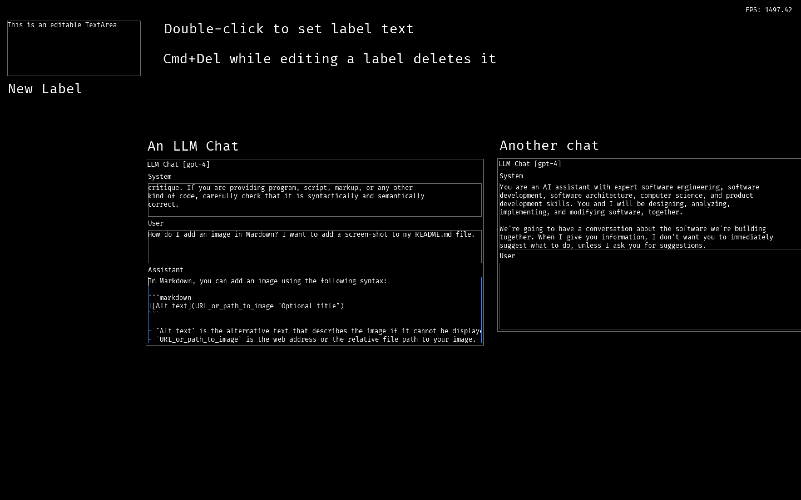

AISH(3) -- AI Shell 
==

This is a Python GUI (SDL) application. You can chat with AISH, an AI agent with memory.
You can also open multiple basic LLM chats, or create text notes. All of this is on a
scrollable infinite canvas.

_Aish (אֵשׁ): The Hebrew word "Aish" translates to "fire, light, or flame" in English._

_In Korean, "Aish (아이씨)" or sometimes just "Ai (아이)" is a common informal exclamation often used to express frustration, annoyance, or mild surprise, somewhat equivalent to "Oh no!", "Darn!", or "Ugh!" in English._

So, Prometheus and Dr. Faustus. It captures the promise and the peril of AI.

### Keyboard Commands

#### Verified on macOS and Windows
|Mac|Windows|Description|
|-------|-----|-----------|
|Cmd+Q|Alt+F4|Quit|
|Cmd+S|Ctrl+S|Save workspace to file named by --workspace command-line param (default aish_workspace.json)|
|Cmd+L|Ctrl+L|Load workspace from file named by --workspace command-line param (default aish_workspace.json)
|Cmd+B|Ctrl+B|Add a new Label at the current cursor position|
|Cmd+G|Ctrl+G|Send messages to GPT-4 for chat completion when you have an LLM Chat control focused|
|Cmd+N|Ctrl+N|Create a new GPT-4 chat|
|Cmd+T|Ctrl+V|Create a new TextArea (use it like a post-it note)|

#### Verified only on macOS
|Mac|Windows|Description|
|-------|-----|-----------|
|Cmd+U| |Add another "user" message text field|
|Cmd+Delete| |Delete the currently selected chat message (inside a chat), or the current chat (if whole chat is focused). Also works for other controls|
|Cmd+R| |Use Voice out to say some sample text|
|Cmd+Enter| |Toggle active listening mode (speech to text transcription)|
|Cmd+V| |Paste text from clipboard into focused TextArea|
|TAB| |Focus next control|
|Shift+TAB| |Focus previous control|
|Enter| |Move focus down into children of currently focused control|
|Esc| |If the currently focused control has selected text, then clear the selection. Otherwise, move focus up to parent container|
|Ctrl+TAB| |Insert TAB char into currently focused TextArea|
|Arrow L/R/U/D| |Move within TextArea|
|Option/Alt+Arrow L/R| |Move to start of previous / next word|
|Cmd+L/R Arrow| |Move to beginning/end of current line.|
|Mouse Wheel Up/Down| |Scroll focused TextArea|
|Cmd+Up| |Move to beginning of focused TextArea|
|Cmd+Down| |Move to end of focused TextArea|
|Shift+Movement Command| |Extend selection within TextArea|
|Delete| |Remove previous char in TextArea|
|Other keys| |Insert text char into focused TextArea|

### Running it

`python aish3.py`

#### Command-line parameters/settings:

`python aish3.py --help`

yields:

    usage: aish3.py [-h] [--fullscreen] [--width WIDTH] [--height HEIGHT] [--voice-in] [--workspace WORKSPACE]
    
    AISH window application.
    
    options:
      -h, --help            show this help message and exit
      --fullscreen          run in fullscreen mode
      --width WIDTH         window width (default: 1450)
      --height HEIGHT       window height (default: 800)
      --voice-in            Enable voice input (default: False)
      --workspace WORKSPACE workspace file (default: aish_workspace.json)

#### Setting up required environment variables

If you want to make GPT API requests, you'll need to provide a couple of environment variables in a .env file:

    OPENAI_ORGANIZATION = "..."
    OPENAI_API_KEY="..."

To use speech-to-text transcription, you'll need an AssemblyAI API KEY

    ASSEMBLYAI_API_KEY="..."

In order to use voice output (text to speech), you'll need Google Cloud credentials:

    GOOGLE_APPLICATION_CREDENTIALS="..."

And finally, to use the wakeup phrase detection, you'll need a PicoVoice access key:

    PICOVOICE_ACCESS_KEY="..."

If you get tired of entering System prompt text into LLM chats, you can set
a default system prompt using:

    DEFAULT_SYSTEM_PROMPT="..."

NOTES:

Requirements / Prerequisites:
--

Python 3

Python SDL2 libraries for macOS: 
`brew install sdl2`

PySDL2 Python wrapper
`pip install pysdl2`

Build a stand-alone macOS application
--
You can build a standalone application by doing:
`make macos`

Run it as:
`./dist/aish3`

This requires the pyinstaller Python module
`pip3 install pyinstaller`
